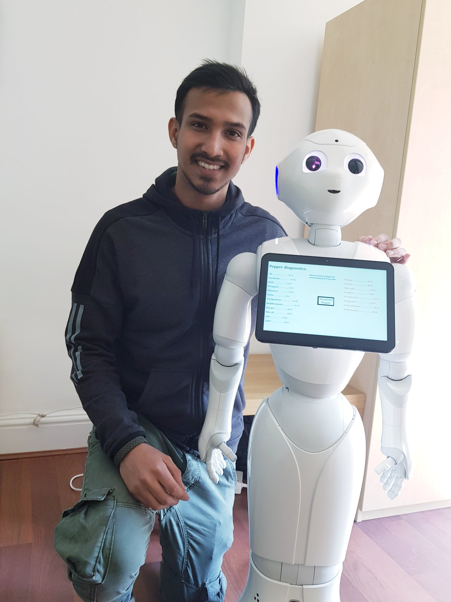

# 🤖 Smart Restaurant Automation: A Robot Waiter Concept

This project outlines the design of a robot waiter, a conceptual project I completed in **2018** during my first year of university. It explores its hardware and software architecture, functionality, and accessibility features.
---

## 🚀 Key Features & Functionality

The robot waiter's design includes a number of core functions:

* **Customer Interaction:** It is functioned to speak in English. If someone speaks a different language, it will ask for help from staff. It can greet customers, seat them by searching for an available table, and take orders by talking to them or using a touch pad.
* **Payment Processing:** The robot can handle payments via a contactless card machine for payments under £30 or a cash slot for cash. Receipts will come out after a card payment is made.
* **Serving and Cleaning:** The robot can line-up in the kitchen and wait for food. Staff will help it take the food in a tray to customers. Customers can also tap a button on their table for the robot to come and take all dishes back to the kitchen.
* **Supply Management:** Kitchen staff can use the robot’s online tab to order groceries and accessories for the restaurant if they run out of anything.

---

## ⚙️ Hardware and Software Architecture

The design emphasizes a modular approach. The hardware is designed to run the system, but without software, it will not know what to do. All software is stored in the robot's memory and loaded into the hardware to give instructions. Key components include:

* **Sensors and Navigation:** A complex laser distance detector is fitted to detect the distance of walls and people. An IR sensor is also used to designate a path.
* **Cameras:** Two 360-degree cameras are fitted in the front and back to see the surrounding environment and detect things like people and walls.
* **Networking:** A Wi-Fi connector allows the robot to automatically connect to the restaurant’s Wi-Fi. The robot's system connects with the restaurant system so staff can see customer orders and table numbers.
* **Security:** A "Safe guard" is a special software used to secure the system's camera, instructions, and touch pad from harmful things. The power button is a finger sensor so that only staff can use it.

---

## 📚 Transferable Skills & Learnings

This project was a valuable exercise in several areas relevant to networking and cybersecurity:

* **Networking Fundamentals:** I gained a foundational understanding of how devices connect and communicate over a network, as the robot relies on Wi-Fi to connect to the restaurant's system to access customer orders and table information.
* **System Security:** The design incorporates a "Safe guard" software to secure the system. This highlights the importance of protecting a system's integrity and data. The use of a finger sensor for the power button also demonstrates an understanding of basic physical security and access control.
* **Problem-Solving & Logic:** The project's flow diagram demonstrates a logical approach to problem-solving, outlining the steps and decision-making processes for the robot's functions.

---

## 🖼️ Project Visuals

The images below illustrate the conceptual design of the robot waiter, including its physical components and operational logic.

#### Robot Platform Design

#### Modular Function Flowchart

---

## 🛠️ Hands-On Experience

This project was a key part of my journey into technology during my university years. Here I am in the university lab, working with a similar robot platform that inspired this design.

---

## 📂 Files in this Repository

* `images/`: Folder containing all diagrams and images.
* `Design Assignment.docx`: The original project report document.

---
✨ *This project blends creativity, engineering, and cybersecurity awareness into a single conceptual design for the future of smart restaurants.*
